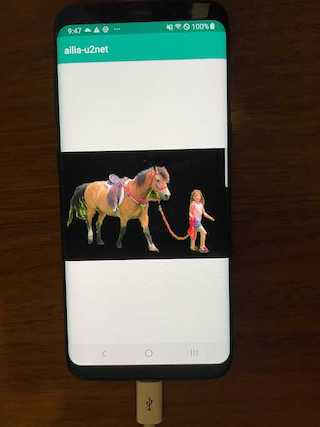

# ailia-android-studio

Demo project of ailia SDK with Android Studio (Java)



## Test environment

- macOS 10.14.6
- Android Studio 3.5.3

## Setup

Please put ailia libraries here.

```
app/src/main/jniLibs/arm64-v8a/libailia.so
app/src/main/jniLibs/armeabi-v7a/libailia.so
app/src/main/jniLibs/x86/libailia.so
app/src/main/jniLibs/x86_64/libailia.so
```

## Detail

Apply u2net to input image. Resources is here.

```
app/src/main/res/raw/input.png
app/src/main/res/raw/u2netp_opset11_proto.prototxt
app/src/main/res/raw/u2netp_opset11_weight.onnx
```

## Main code

[MainActivity.java](/app/src/main/java/jp/axinc/ailia_u2net/MainActivity.java)